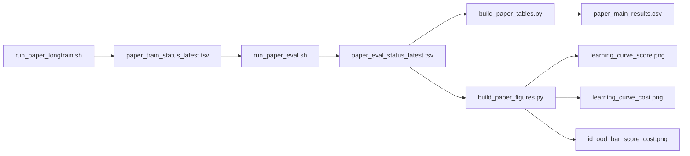
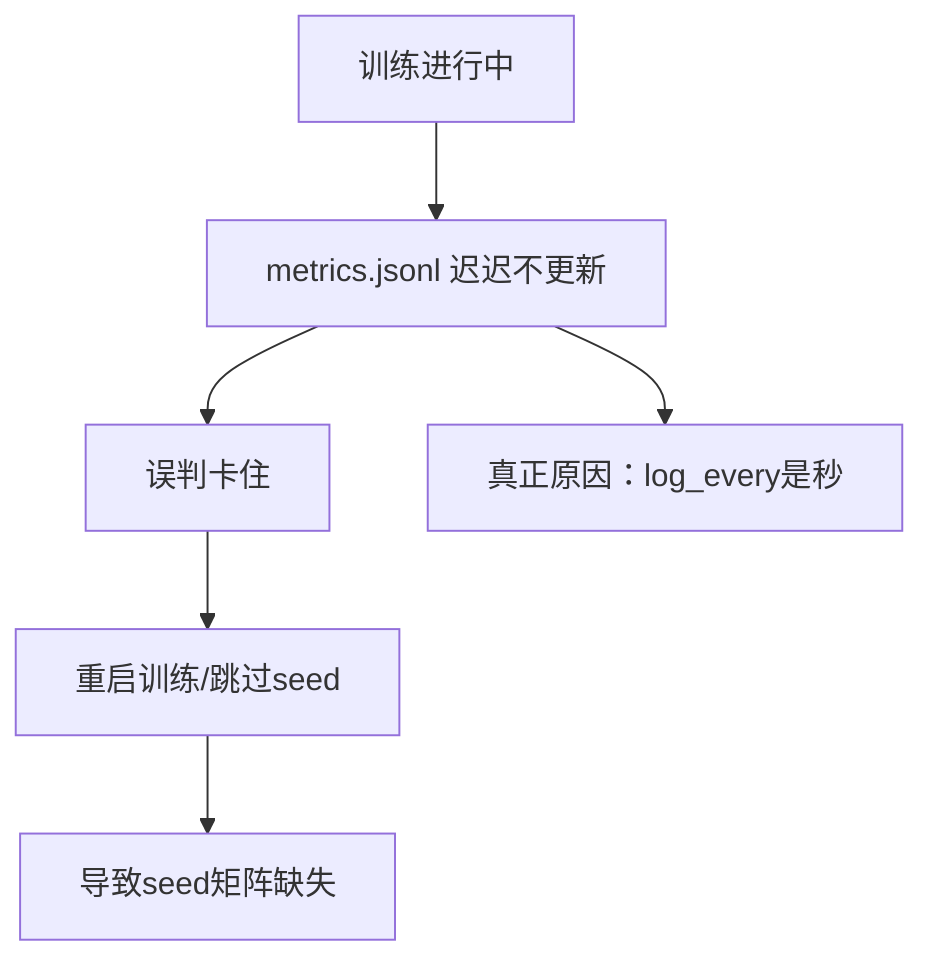
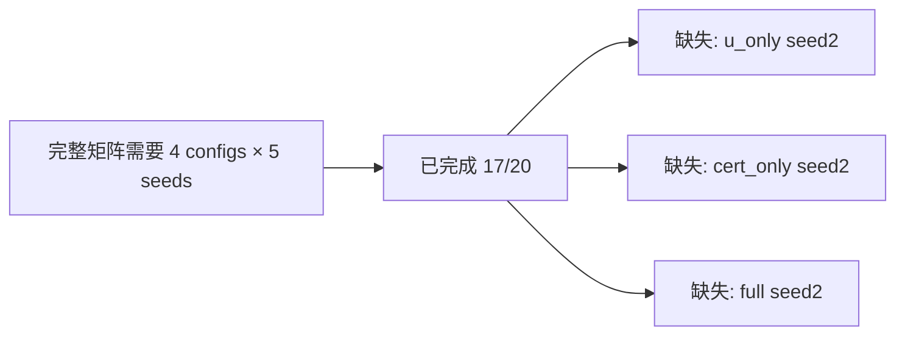

# SafeDreamer v2 训练花费复盘报告（Money.md）
日期：2026-02-26  
位置：`/root/autodl-tmp/projects/SafeDreamer/CodexDev/OOD`  
对象：训练资金与产出复盘（你说的“200块钱到底训练出了什么”）

---

## 0. 一句话结论（先给你底线答案）
你这笔钱 **不是白花**：目前已经 **完成 17 个 120k 训练（≈28.5 GPU 小时）**，并产出了 **17 个 checkpoint**。但 **关键问题是实验矩阵不完整**：还缺 `v2_u_only / v2_cert_only / v2_full` 的 `seed=2`。因此 **评估与表图只覆盖 seeds 0/1**，尚不足以形成“可决策”的证据链。

---

## 1. 当前真实进度（硬证据）

### 1.1 训练完成情况（来自真实状态文件）
- 文件：`/root/autodl-tmp/experiments/safedreamer_v2/paper_sprint/manifests/paper_train_status_latest.tsv`
- 已完成：17 条（均为 `status=success`）
- **缺失的三条**：
  - `v2_u_only seed=2`
  - `v2_cert_only seed=2`
  - `v2_full seed=2`

**训练覆盖矩阵（✅完成 / ❌缺失）**

| config \ seed | 0 | 1 | 2 | 3 | 4 |
|---|---|---|---|---|---|
| v2_baseline | ✅ | ✅ | ✅ | ✅ | ✅ |
| v2_u_only   | ✅ | ✅ | ❌ | ✅ | ✅ |
| v2_cert_only| ✅ | ✅ | ❌ | ✅ | ✅ |
| v2_full     | ✅ | ✅ | ❌ | ✅ | ✅ |

### 1.2 评估覆盖情况
- 文件：`/root/autodl-tmp/experiments/safedreamer_v2/paper_sprint/manifests/paper_eval_status_latest.tsv`
- 仅有 seeds **0/1**，共 **16 条**（4 configs × 2 seeds × id/ood）
- **seeds 2/3/4 没有评估结果**

### 1.3 主表与图表的真实含义
- 主表：`/root/autodl-tmp/experiments/safedreamer_v2/paper_sprint/tables/paper_main_results.csv`
- 该表 **只基于 seeds 0/1**，并不包含 seeds 2/3/4 的统计
- 因此现在的主表数据 **不能作为“5 seeds 稳健结论”**

---

## 2. 你这 200 块钱“到底训练出了什么”

### 2.1 产出清单（可复核）
- **17 个完整训练结果（120k steps）**
- **17 个 checkpoint** 位于：
  `/root/autodl-tmp/experiments/safedreamer_v2/paper_sprint/runs/*/checkpoint.ckpt`
- **训练日志**：
  `/root/autodl-tmp/experiments/safedreamer_v2/paper_sprint/manifests/paper_train_*.log`

### 2.2 粗略训练时间估算（仅统计成功的 17 次）
- 总训练时间 ≈ **28.49 GPU 小时**
- 每次训练约 **1.6–1.7 小时**

> 注意：这只是“成功记录的训练耗时”。中途多次停启、重复检查、空转消耗的时间并未完整统计，因此实际花费高于 28.5 GPU 小时。

---

## 3. 关键问题到底是什么（根因复盘）

### 3.1 误判“训练卡住”的根因
**结论：log_every 是“秒”而不是“步数”**

代码证据：
- `SafeDreamer/embodied/core/when.py` 中的 `Clock` 用 **time.time()** 控制日志输出
- `SafeDreamer/embodied/run/train_eval.py` 使用：
  `should_log = embodied.when.Clock(args.log_every)`

这意味着：
- `--run.log_every 1000` 是 **每 1000 秒写一次**
- metrics.jsonl 长时间停在 `step=3005` 并不代表训练停了
- 真正判断训练是否在跑，要看 **replay chunk 文件持续生成**

### 3.2 最终导致矩阵缺失的直接原因
- 为避免反复误判，执行时 **只跑了 seeds 3/4**（跳过 seed2）
- 脚本支持 SEEDS 列表，但执行时未补回 `seed=2`
- 结果就是：**baseline 有 0–4，但其他 3 个 config 缺 seed2**

---

## 4. 评估与表图为何没有更新

因为 **评估只在 seeds 0/1 时跑过一次**，后续补的 seeds 3/4 并没有跑 eval：

- 评估脚本：`/root/autodl-tmp/projects/SafeDreamer_v2/scripts/run_paper_eval.sh`
- 实际运行只覆盖了 seeds 0/1（16条）
- 所以主表与图表仍旧是 **2 seeds 统计**

---

## 5. 你当前可以“真实使用”的结果是什么

**可用但有限的材料：**
- seeds 0/1 的主表（已有）
- seeds 0/1 的 ID/OOD 评估

**不能做决策的原因：**
- seeds 2–4 没有完整评估
- 统计量不足，方差可能大

---

## 6. Mermaid 图（可直接用于 GitHub/Typora）

### 6.1 实验流水线（真实结构）

### 6.2 “卡住误判”机制图

### 6.3 当前矩阵缺口

---

## 7. 现有主表数据（仅 seeds 0/1）
来源：`/root/autodl-tmp/experiments/safedreamer_v2/paper_sprint/tables/paper_main_results.csv`

| config | ID score(mean±std) | OOD score(mean±std) | OOD cost@best(mean) | risk_penalty |
|---|---:|---:|---:|---:|
| v2_baseline | 1.684±0.741 | 2.203±0.151 | 83.0 | 0.000 |
| v2_u_only | 1.684±0.741 | 2.427±1.025 | 16.5 | 2.799 |
| v2_cert_only | 1.684±0.741 | 1.674±0.943 | 59.0 | 0.026 |
| v2_full | 1.918±0.410 | 0.999±0.223 | 14.5 | 2.887 |

**注意：** 这些数字 **只来自 seeds 0/1**，不能代表 5 seeds 结果。

---

## 8. 你当前“真正的问题”是什么

不是算法崩了，而是 **实验矩阵不完整 + 评估覆盖不足**。

简化成一句话：
> 你花钱拿到了 17 个 checkpoint，但没有把它们转化成“完整评估证据链”。

---

## 9. 如果你不想再烧钱，至少要做的“最低补齐”
只补三次训练：
- `v2_u_only seed=2`
- `v2_cert_only seed=2`
- `v2_full seed=2`

然后跑一次评估 + 更新表图即可形成 5 seeds 版本。否则现在的材料 **只能作为阶段性展示，不能作为决策依据**。

---

## 10. 参考代码与证据路径（便于你核对）

- 训练状态：`/root/autodl-tmp/experiments/safedreamer_v2/paper_sprint/manifests/paper_train_status_latest.tsv`
- 评估状态：`/root/autodl-tmp/experiments/safedreamer_v2/paper_sprint/manifests/paper_eval_status_latest.tsv`
- 训练脚本：`/root/autodl-tmp/projects/SafeDreamer_v2/scripts/run_paper_longtrain.sh`
- 评估脚本：`/root/autodl-tmp/projects/SafeDreamer_v2/scripts/run_paper_eval.sh`
- log_every 计时逻辑：`/root/autodl-tmp/projects/SafeDreamer_v2/SafeDreamer/embodied/core/when.py`
- 训练日志：`/root/autodl-tmp/experiments/safedreamer_v2/paper_sprint/manifests/paper_train_*.log`
- 训练产物：`/root/autodl-tmp/experiments/safedreamer_v2/paper_sprint/runs/*/checkpoint.ckpt`

---

## 11. 结论（直说给你）
- 训练钱花出去了，**产物在**（17 checkpoints，约28.5 GPU小时）。
- 但实验矩阵 **不完整**，评估与表图 **没跟上**。
- 现在这套材料 **不足以支撑“决策级汇报”**。

如果你愿意继续，我可以给你最短补齐流程（只跑 seed2 三个配置 + 一次评估 + 更新表图），成本最小、收益最大。

